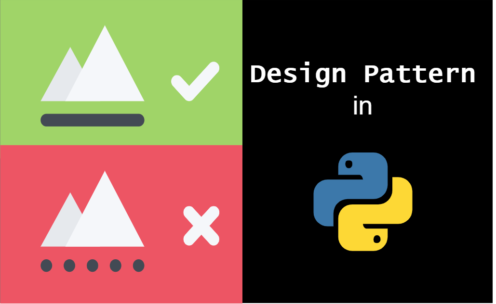

- by Erich Gamma, one of GoF(gang of four) authors

## [[Creational Patterns]]
- deal with the creation(construction) of objects
- **explicit**(constructor) vs. **implicit**(DI, reflection, etc.)
- wholesale(single statement) vs. piecewise(step by step)

## [[Structural Patterns]]
- concerned with the structure(e.g. class members)
- many patterns are wrappers that mimic the underlying class interface
- stress the importance of good API design

## [[Behavior Patterns]]
- No central theme
- solve particular problem
- solve in particular way
- behave particular set of concern

## Reference
- SOLID
    - SRP
        - [letters' frequency plot](http://pi.math.cornell.edu/~mec/2003-2004/cryptography/subs/frequencies.html)